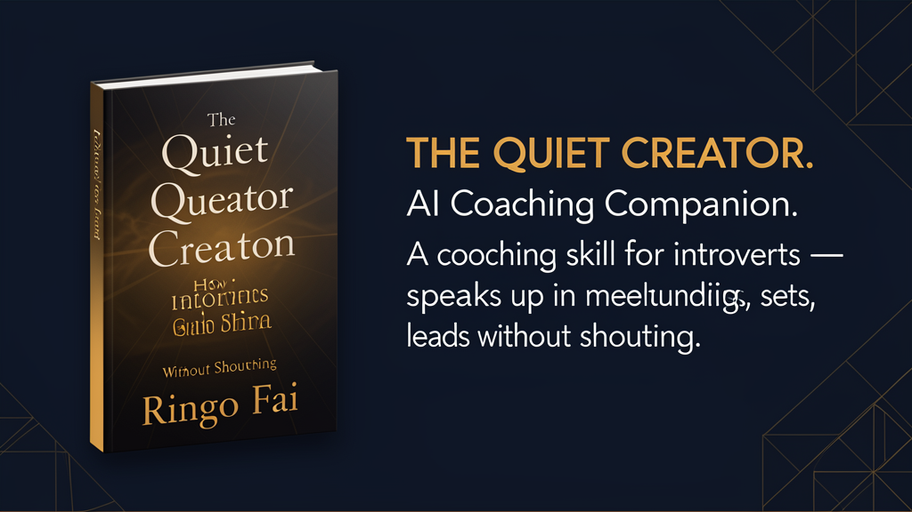
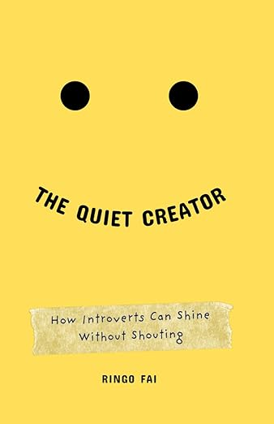

# AI Coach for Introverts

[](https://agentskills.io)
[](LICENSE)
[](https://www.amazon.com/dp/B0DT94SPRB)



> An AI Agent skill that coaches you through real situations — speaking up in meetings, setting boundaries, managing your energy, leading without shouting. Not encouragement. A practical system.

---

## Install

```bash
npx skills add ringofai/the-quiet-creator
```

Then ask your agent:

> *"I have a difficult conversation coming up. Let me practice."*
> *"I keep getting interrupted in meetings. What do I do?"*
> *"I feel drained and I don't know why. Let's audit my energy."*
> *"I need to prepare for a performance review."*

---

## What You Can Do in 5 Minutes

**Prepare for a tough conversation (3 minutes)**
Ask your agent: *"I need to tell my manager I'm overwhelmed. Help me prepare."*
→ The agent roleplays the conversation. You practice. You get feedback. You try again.

**Audit where your energy goes (2 minutes)**
Ask your agent: *"Let's do an Energy Audit."*
→ You leave with a clear map of what drains you and what restores you.

**Reframe a self-critical thought (30 seconds)**
Say something self-critical. The agent catches it and reframes it as a strength — instantly.

---

## This vs Everything Else

| You could... | And get... | Or install this and get... |
|:-------------|:-----------|:---------------------------|
| Read a book about introversion | One perspective, no practice | The frameworks live, adapted to your energy today, with real roleplay |
| Ask ChatGPT for advice | Polite generalities, no follow-through | A coach who tracks your progress, catches self-criticism, and holds you accountable |
| Take a communication course | One-size-fits-all techniques | Exercises that adapt to your introversion type (Solitude Seeker vs Gentle Socializer, Reflector vs Think-Out-Louder) |
| See a therapist | Weekly sessions, high cost | On-demand coaching between sessions. Your journal stays with you. |

---

## What You Can Do With This

**Prepare before any high-stakes conversation.** A performance review. A difficult boundary. A presentation. A networking event. Load the skill, describe the situation, and the agent runs a structured coaching session — with roleplay, feedback, and a takeaway you can use immediately.

**Understand your energy patterns.** Run the Energy Audit once and you'll know exactly which meetings drain you and which activities restore you. Run it monthly and you'll see how your energy changes across seasons of life.

**Build a Quiet Win Log over time.** Every session captures one quiet win — something you did that honored your strengths. Over weeks, you build a record of proof that you're growing, not guessing.

**Practice the hard conversations before they happen.** The agent roleplays your manager, your colleague, your audience. You practice. You stumble. You get better. No real stakes. Real growth.

**Catch and reframe self-criticism in real time.** The Reframer is always on. You say "I take too long to answer." The agent reframes: "You process deeply before you speak. That means when you do speak, it's worth hearing." No announcement. Just a clearer view.

---

## Who It's For

**Professionals who are quiet in meetings but brilliant in writing** — Learn to prepare before the meeting, buy yourself time when put on the spot, and make your quiet contribution land with more weight.

**Creators who do their best work alone but struggle to promote it** — Get coaching on pitching, networking, and advocating for your work without feeling like you're selling out.

**Leaders who lead with empathy, not volume** — Develop your quiet leadership style. Set boundaries without guilt. Influence decisions without dominating conversations.

**Anyone who has ever thought "I'm too quiet for this world"** — Not to become louder. To become more intentional.

---

## What's Inside

| Framework | What It Trains | Outcome |
|:----------|:---------------|:--------|
| **PREP** — Pause, Reframe, Engage, Proceed | Being put on the spot and responding with clarity | The freeze-and-regret cycle loosens |
| **3-Door Decision Model** — Walk Through, Peek Inside, Walk Away | Making intentional choices about where to spend energy | Guilt dissolves. You decide, not your inner critic. |
| **Energy Audit** | Identifying drains vs recharges with precision | You stop running on empty |
| **Introversion Map** | Energy Source, Processing Style, Social Stamina | A personalized starting point, not generic advice |
| **Boundary Rehearsal** | Practicing difficult conversations live | You walk in prepared, not anxious |
| **Quiet Win Log** | Tracking growth across sessions | You see proof you're moving, not guessing |

---

## What Makes This Work

The coaching frameworks in this skill are drawn from established research on introversion psychology, energy management, communication skills, and adult learning. Each framework was chosen because it addresses a specific gap that introverts face:

| Gap | Framework | Why It Works |
|:----|:----------|:-------------|
| Freeze when put on the spot | PREP | Gives you a repeatable structure for those 3 seconds of silence |
| Say yes to things you resent | 3-Door Decision | Makes the choice visible — not "should I?" but "which door?" |
| Feel drained without knowing why | Energy Audit | Precision replaces vagueness. You can't fix what you can't name. |
| Don't know your introversion type | Introversion Map | One-size-fits-all advice fails. This starts with who you are. |

But having the frameworks isn't enough. The skill contains behavioral instructions so the agent acts like a real coach:

- **Reads your state** — Are you building, blocked, or dismissing? It responds differently to each.
- **Follows up across sessions** — "Last time you said you'd try X. How did it go?" Commitments aren't forgotten.
- **Catches self-criticism live** — The Reframer is always on, never announced.
- **Detects polite agreement** — If you say "this is helpful" without specifics, it asks for one concrete takeaway.
- **Adapts to neurodivergence** — If sitting still doesn't work, it offers walking exercises, timers, scribble-based reflection.

---

## Edge Cases Handled

| Situation | What happens |
|:----------|:-------------|
| You're skeptical | 2-minute micro-session. No commitment. You decide. |
| You get emotional mid-session | Pauses coaching. Offers grounding or exit. |
| You're from a culture where speaking up is disrespectful | Adapts to your context. Won't push Western assertiveness frameworks. |
| You have ADHD or are highly sensitive | Offers walking exercises, timers, scribble-based reflection instead of sitting still. |
| You say "this is helpful" without specifics | Detects performative agreement. Asks for one concrete takeaway before closing. |
| You come back after months away | Reads your journal. Picks up where you left off. |
| You have no idea what to work on | Runs an Energy Forecast. The topic emerges from your week ahead. |

---

## ⭐ Like This?

Star the repo. It helps other introverts find a coaching system, not just encouragement.

## License

[CC BY 4.0](LICENSE) — Free to share and adapt with attribution to Ringo Fai.

---

*Based on the book [The Quiet Creator: How Introverts Can Shine Without Shouting](https://www.amazon.com/dp/B0DT94SPRB) by Ringo Fai.*


